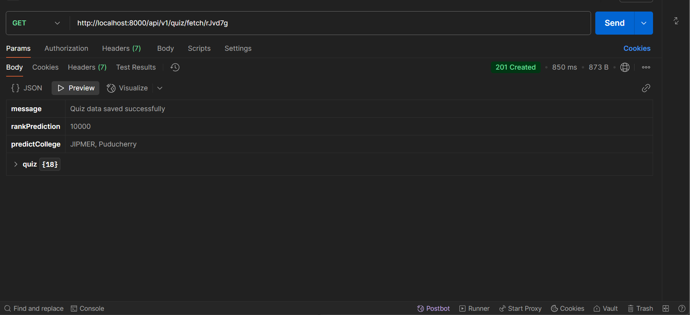
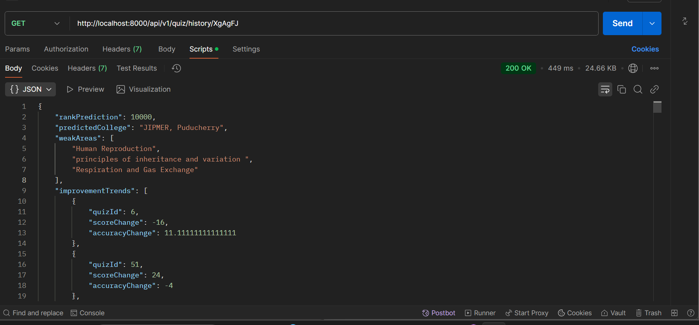
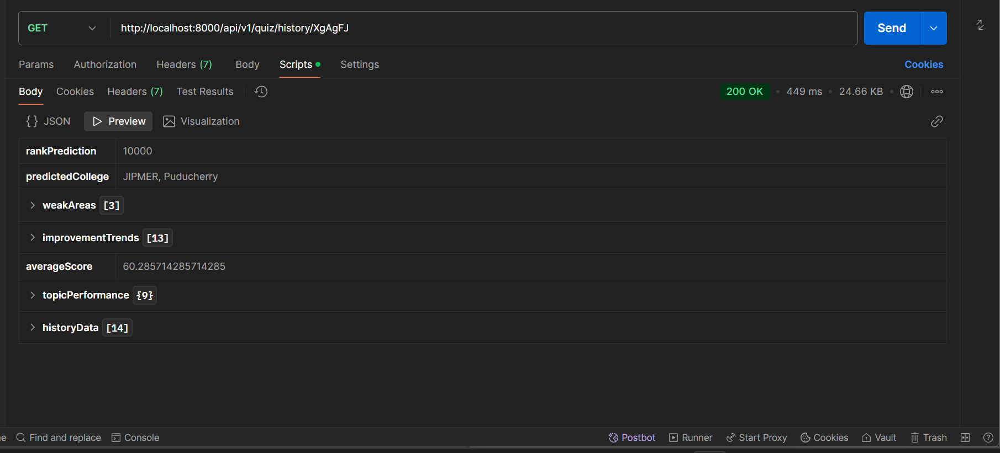
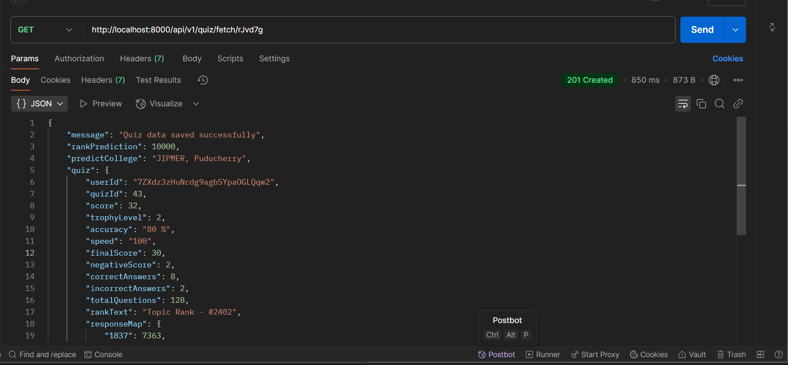

# **NEET Student Rank Predictor and College Recommendation System**

## **Project Overview**

This project aims to predict a student's NEET exam rank based on their quiz history, performance trends, and accuracy. It also suggests the most likely medical colleges the student could be admitted to based on the predicted rank. The system helps students track their quiz performance, identify weak areas, and monitor improvements over time.

## **Features**

- **Rank Prediction**: Predicts the most likely rank of a student based on their quiz performance (score, accuracy).
- **College Recommendation**: Suggests the most likely college based on the predicted NEET rank.
- **Weak Areas Identification**: Detects topics where a student needs improvement.
- **Trend Tracking**: Tracks improvements in score and accuracy over time.
- **Quiz History Analysis**: Analyzes quiz history to provide insights into student performance.

## **Technologies Used**

- **Backend**: Node.js, Express.js
- **Database**: MongoDB
- **API Integration**: Axios for fetching quiz data
- **Data Parsing**: JavaScript for processing and analyzing data
- **Deployment**: (e.g., Heroku, AWS) for hosting the server

## **Setup Instructions**

### **Prerequisites**

- Node.js (v14 or higher)
- MongoDB (local or remote)

### **Installation Steps**

1. **Clone the repository**:

   ```bash
   git clone https://github.com/varun2138/neet-rank-predictor.git

   cd server
   ```

npm install

Set up environment variables:

Create a .env file in the root directory and add the following:
QUIZ_API_URL=<Your quiz API URL>
MONGO_URI=<Your MongoDB URI>

To start the server, run:

bash
npm start

# _Approach_

Data Collection

Quiz history is fetched from a third-party API based on the user's ID. Each quiz entry includes performance metrics such as score, accuracy, topics, and difficulty.

Rank Prediction

The system calculates the average score and accuracy across the user's quizzes. Based on these averages, a rank range is predicted using predefined thresholds (e.g., top 100, top 500, etc.). The predicted rank is then used to recommend the most likely college from a list of medical colleges.

Weak Area Identification

The system identifies topics where the user has performed poorly (average score below 50%). Weak areas are displayed to the user to help them focus on improving.

Trend Tracking

The system tracks changes in score and accuracy over time. It calculates the change in accuracy and score between consecutive quizzes to monitor progress.

Predicted College Based on Rank

The predicted rank is used to estimate the most likely colleges a student can be admitted to, considering the typical cutoffs for NEET ranks. For example:

Top 100: Premier institutes like AIIMS, Delhi
Top 500: Tier 2 institutes
Top 1000: Good state-level medical colleges
Below 1000: Additional recommendations based on state-wise cutoffs

# **Screenshots of Key Visualizations**

Quiz History Analysis, Predicted Rank and College,Weak Areas and Improvement Trends






Conclusion
This system helps NEET aspirants track their progress, predict their rank, and plan their studies more effectively. By suggesting likely colleges based on predicted rank, students can focus on the right strategies to improve their performance and maximize their chances of admission to the desired college.

Future Enhancements
Personalized College Recommendations: Use user location, preferences, and past results to recommend colleges more accurately.
Real-Time Score Updates: Integration with live quiz platforms to provide real-time rank predictions.
User Feedback Integration: Collect user feedback to refine prediction accuracy over time.
